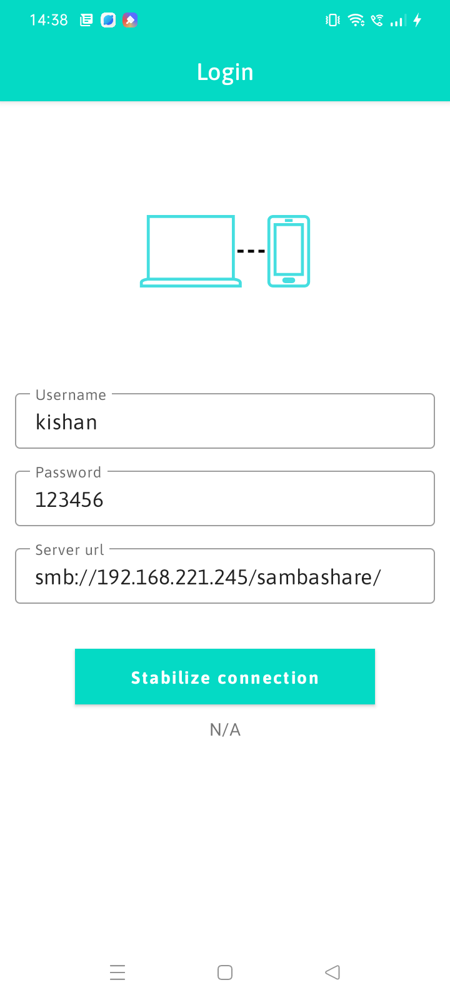
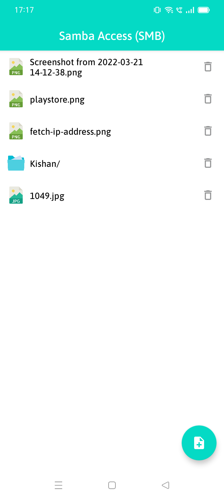
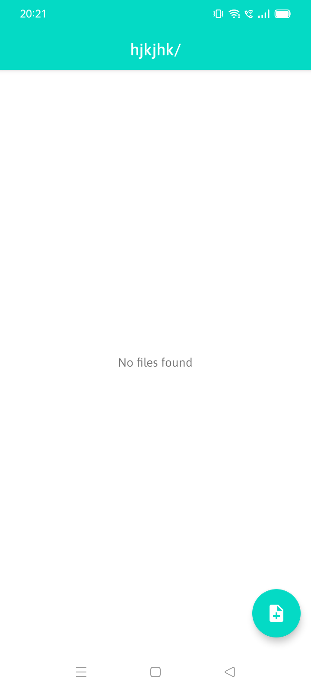
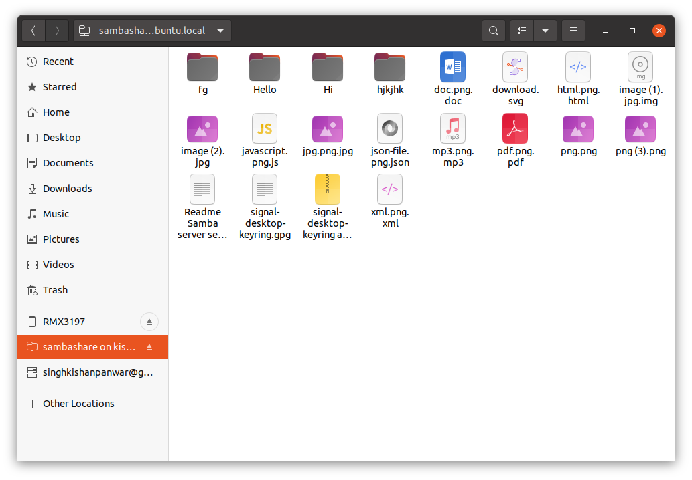
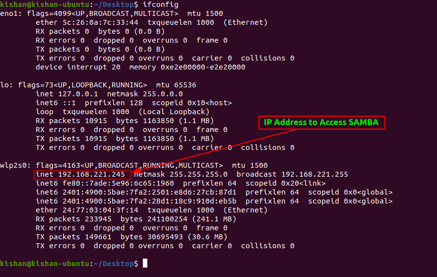

# Samba Server Setup and Access it on Android App (SMB)
This is an Android application, which explains how to set up SMB protocol on Linux and access it in the Android app.

## App Screens
     

## Ubuntu Share Folder
 

## Requirements 
 * Ubuntu machine 
 * Android phone
 * Ethernet or Wifi connection (Phone Hotspot will also work)

## Setup Server
*A Samba file server enables file sharing across different operating systems over a network. It lets you access your desktop files from a laptop and share files with Windows, macOS or Android users.*

To install Samba, we run:

    sudo apt update
    sudo apt install samba
We can check if the installation was successful by running:
```
whereis samba
```

The following should be its output:
```
samba: /usr/sbin/samba /usr/lib/samba /etc/samba /usr/share/samba /usr/share/man/man7/samba.7.gz /usr/share/man/man8/samba.8.gz
```

Now that Samba is installed, we need to create a directory for it to share:
```
mkdir /home/<username>/sambashare/
```
*The command above creates a new folder  `sambashare`  in our home directory which we will share later.
The configuration file for Samba is located at  `/etc/samba/smb.conf`. To add the new directory as a share, we edit the file by running:*
```
sudo nano /etc/samba/smb.conf
```
At the bottom of the file, add the following lines:
```
[sambashare]
    comment = Samba on Ubuntu
    path = /home/username/sambashare
    read only = no
    browsable = yes
```
*Then press  `Ctrl-O`  to save and  `Ctrl-X`  to exit from the  _nano_  text editor.*

 What we’ve just added :

-    *comment: A brief description of the share.*
-   *path: The directory of our share.*
    
-   *read only: Permission to modify the contents of the share folder is only granted when the value of this directive is  `no`.*
    
-   *browsable: When set to  `yes`, file managers such as Ubuntu’s default file manager will list this share under “Network” (it could also appear as browseable).*

Now that we have our new share configured, save it and restart Samba for it to take effect:

```
sudo service smbd restart
```

Update the firewall rules to allow Samba traffic:

```
sudo ufw allow samba
```
Since Samba doesn’t use the system account password, we need to set up a Samba password for our user account:

```
sudo smbpasswd -a username
```
*Note: Username used must belong to a system account, else it won’t save. 
In my case my username is "kishan" and I've added samba password "123456"*.

-------
  
**Samba is setup now on your Linux machine,** 
Now we need the IP Address of our system to access it, by running: 
```
ifconfig
```
the output should be like that :

 

Copy that Address, and use the address in that format:

```
smb://ip-address/sambashare/
```
---
 **Now our SMB share details should be like that:**
 

 - **Server Address**: smb://192.168.221.245/sambashare/
 - **Username** : kishan 
 - **Password** : 123456 

## Setup App
So We aready setup the SMB share on our linux system, and we have Server Address, Username and Password. 
- Install the app in phone
- On Login screen provide the details
- Click on Stabilize connection, if everything is okay then you can see the Directories and Files of the folder.
- That's all. 

## Related
Here are some related guides:

Setup Server : https://ubuntu.com/tutorials/install-and-configure-samba#1-overview </br>
JCIFS Jar    : https://www.jcifs.org

## Support

For support, email singhkishanpanwar@gmail.com or send message to Skype : https://join.skype.com/invite/fBcaUWiNAWTh


## Contribution

🌟 Thank you for using this project and If this is useful for you, then please Star 🌟 this. Also you can send pull request and create a issue for any bug. Thanks again.
